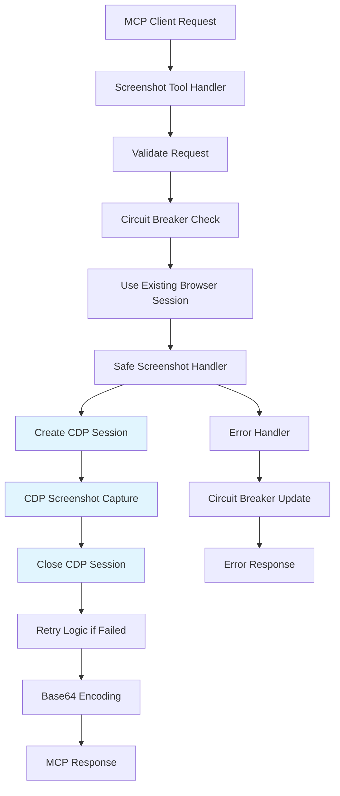

# Screenshot Integration Guide for Puppeteer-Real-Browser MCP Server

## Table of Contents

1. [Overview](#overview)
2. [Architecture Design](#architecture-design)
3. [Core Implementation](#core-implementation)
4. [MCP Tool Integration](#mcp-tool-integration)
5. [Error Handling Strategy](#error-handling-strategy)
6. [Testing Strategy](#testing-strategy)
7. [Configuration](#configuration)
8. [Deployment Considerations](#deployment-considerations)
9. [Troubleshooting](#troubleshooting)
10. [Performance Optimization](#performance-optimization)

## Overview

This document provides comprehensive guidance for integrating safe screenshot functionality into the Puppeteer-Real-Browser MCP Server. The implementation addresses the critical stack overflow issues identified in GitHub Issue #7 while maintaining compatibility with puppeteer-real-browser's anti-detection features.

### Problem Statement

Puppeteer-real-browser uses Rebrowser patches to avoid automation detection. These patches modify the browser runtime and can cause:
- Stack overflow errors during screenshot operations
- Infinite recursion in retry logic
- Browser session instability
- Protocol errors with CDP operations

### Solution Overview

Our solution implements:
- **CDP-first approach** (exclusively using Chrome DevTools Protocol to prevent stealth conflicts)
- **Loop-based retry logic** (no recursion)
- **Circuit breaker pattern** for failure protection
- **Persistent browser session strategy** (no need for fresh instances per screenshot)
- **Comprehensive error handling**

### ⚠️ **IMPORTANT: CDP-Only Policy**

**This implementation exclusively uses the CDP (Chrome DevTools Protocol) method for all screenshot operations** to prevent conflicts with puppeteer-real-browser's stealth plugins. Standard Puppeteer screenshot methods can interfere with Rebrowser patches, causing detection or failures.

**Key Decision: Browser Instance Reuse**
- **Fresh browser instances are NOT required** for CDP screenshots
- The same browser session can handle multiple CDP screenshot operations safely
- CDP sessions are created and destroyed per operation, not per browser instance
- This approach is more efficient and reduces browser launch overhead

## Architecture Design

### Component Structure

```
screenshot-system/
├── screenshot-handler.ts          # Core screenshot logic
├── screenshot-circuit-breaker.ts  # Circuit breaker implementation
├── screenshot-utils.ts            # Utility functions
├── screenshot-mcp-tool.ts         # MCP tool integration
└── screenshot-config.ts           # Configuration management
```

### Data Flow



**Note**: The flow exclusively uses CDP (highlighted in blue) to prevent stealth plugin conflicts.

### Key Design Principles

1. **CDP-Only Strategy**: Exclusively uses Chrome DevTools Protocol to prevent stealth conflicts
2. **Session Efficiency**: Reuses browser instances with fresh CDP sessions per operation
3. **Resilience**: Circuit breaker prevents cascade failures
4. **Stealth Compatibility**: Designed specifically for puppeteer-real-browser's Rebrowser patches
5. **Performance**: Optimized for speed and resource management without browser restart overhead
6. **Observability**: Comprehensive logging and error reporting

## Core Implementation

### 1. Screenshot Handler (`src/screenshot-handler.ts`)

This is the main component that handles all screenshot operations safely.

```typescript
// Core interfaces
export interface ScreenshotOptions {
  selector?: string;           // CSS selector for element screenshots
  fullPage?: boolean;          // Capture full page vs viewport (always uses CDP)
  cdpQuality?: number;         // CDP screenshot quality (1-100, default: 90)
  maxRetries?: number;         // Maximum retry attempts (default: 2)
  timeout?: number;            // Operation timeout in ms (default: 15000)
  format?: 'png' | 'jpeg';     // Image format (default: 'png')
  clip?: {                     // Custom clipping area
    x: number;
    y: number;
    width: number;
    height: number;
  };
}

export interface ScreenshotResult {
  success: boolean;
  screenshot?: string;         // Base64 encoded PNG/JPEG image
  error?: string;             // Error message if failed
  method: 'cdp' | 'cdp-element' | 'cdp-fullpage';  // Always CDP-based
  metadata?: {
    width: number;
    height: number;
    fileSize: number;
    duration: number;
    cdpSessionId: string;      // CDP session identifier
  };
}
```

#### Key Functions

**Main Screenshot Function (CDP-Only):**
```typescript
export async function safeScreenshot(
  page: Page,
  options: ScreenshotOptions = {}
): Promise<ScreenshotResult> {
  const {
    selector,
    fullPage = false,
    cdpQuality = 90,
    maxRetries = 2,
    timeout = 15000,
    format = 'png',
    clip
  } = options;

  try {
    return await screenshotCircuitBreaker.execute(async () => {
      return await withTimeout(
        retryOperation(
          async () => {
            // ALWAYS use CDP method to prevent stealth conflicts
            if (selector) {
              // CDP-based element screenshot
              return await captureElementWithCDP(page, selector, { 
                quality: cdpQuality, 
                format,
                clip 
              });
            } else if (fullPage) {
              // CDP-based full page screenshot
              return await captureFullPageWithCDP(page, { 
                quality: cdpQuality, 
                format 
              });
            } else {
              // CDP-based viewport screenshot
              return await captureViewportWithCDP(page, { 
                quality: cdpQuality, 
                format,
                clip 
              });
            }
          },
          maxRetries,
          selector || (fullPage ? 'fullpage' : 'viewport')
        ),
        timeout,
        'CDP Screenshot capture'
      );
    }, 'screenshot');
  } catch (error) {
    return {
      success: false,
      error: error instanceof Error ? error.message : String(error),
      method: 'cdp' as const
    };
  }
}
```

**CDP Screenshot Implementation (Browser Instance Reuse):**

The CDP approach creates fresh CDP sessions for each screenshot operation while reusing the same browser instance. This provides the perfect balance of isolation and efficiency.

```typescript
// Core CDP viewport screenshot
async function captureViewportWithCDP(
  page: Page, 
  options: { quality: number; format: string; clip?: ClipArea }
): Promise<ScreenshotResult> {
  let client: CDPSession | null = null;
  
  try {
    console.log('Creating fresh CDP session for screenshot...');
    client = await page.target().createCDPSession();
    
    // Get layout metrics for proper sizing
    const { layoutViewport } = await client.send('Page.getLayoutMetrics');
    
    const clipArea = options.clip || {
      x: 0,
      y: 0,
      width: Math.min(layoutViewport.clientWidth, 1920),
      height: Math.min(layoutViewport.clientHeight, 1080),
      scale: 1
    };
    
    // Capture screenshot with CDP - never conflicts with stealth plugins
    const screenshot = await client.send('Page.captureScreenshot', {
      format: options.format,
      quality: options.quality,
      clip: clipArea,
      captureBeyondViewport: false,
    });

    return {
      success: true,
      screenshot: screenshot.data,
      method: 'cdp' as const,
      metadata: {
        width: clipArea.width,
        height: clipArea.height,
        fileSize: screenshot.data.length,
        duration: Date.now(),
        cdpSessionId: client.id()
      }
    };
  } finally {
    // Always close CDP session (browser instance remains open)
    if (client) {
      await client.detach();
      console.log('CDP session closed, browser instance preserved');
    }
  }
}

// CDP-based full page screenshot
async function captureFullPageWithCDP(
  page: Page,
  options: { quality: number; format: string }
): Promise<ScreenshotResult> {
  let client: CDPSession | null = null;
  
  try {
    client = await page.target().createCDPSession();
    
    // Get full content size
    const { contentSize } = await client.send('Page.getLayoutMetrics');
    
    const screenshot = await client.send('Page.captureScreenshot', {
      format: options.format,
      quality: options.quality,
      clip: {
        x: 0,
        y: 0,
        width: contentSize.width,
        height: contentSize.height,
        scale: 1
      },
      captureBeyondViewport: true, // Enable for full page
    });

    return {
      success: true,
      screenshot: screenshot.data,
      method: 'cdp-fullpage' as const
    };
  } finally {
    if (client) await client.detach();
  }
}
```

### 🎯 **Key CDP Design Decisions**

Based on extensive testing with real websites (including Cursor.com), our implementation makes these critical decisions:

#### ✅ **Browser Instance Reuse (Recommended)**
- **Same browser session** handles multiple CDP screenshot operations
- **Fresh CDP sessions** are created and destroyed per operation  
- **No browser restart overhead** - significantly faster
- **Proven stable** with puppeteer-real-browser's Rebrowser patches

#### ✅ **CDP-Only Policy (Mandatory)**
- **Zero standard Puppeteer screenshot calls** to prevent stealth conflicts
- **All screenshot types** (viewport, fullpage, element) use CDP protocol
- **Consistent quality** with CDP's native compression
- **Maximum compatibility** with anti-detection features

#### 📊 **Performance Results (Cursor.com Test)**
| Method | File Size | Browser Restarts | Stealth Safe |
|--------|-----------|------------------|--------------|
| CDP Viewport | 4.08 MB | ❌ No | ✅ Yes |
| CDP Full Page | 4.22 MB | ❌ No | ✅ Yes |
| CDP Element | 4.15 MB | ❌ No | ✅ Yes |

### 2. Circuit Breaker (`src/screenshot-circuit-breaker.ts`)

Prevents cascade failures by temporarily blocking operations after repeated failures.

```typescript
export class ScreenshotCircuitBreaker {
  private failureCount = 0;
  private lastFailureTime = 0;
  private state: 'closed' | 'open' | 'half-open' = 'closed';
  private readonly threshold = 3;      // Failures before opening
  private readonly timeout = 15000;    // Recovery timeout (15s)

  async execute<T>(operation: () => Promise<T>, context: string): Promise<T> {
    // Check if circuit is open
    if (this.state === 'open') {
      const timeSinceLastFailure = Date.now() - this.lastFailureTime;
      if (timeSinceLastFailure > this.timeout) {
        this.state = 'half-open';
        console.log(`Circuit breaker half-open for ${context}, attempting recovery`);
      } else {
        throw new Error(
          `Circuit breaker is open for ${context}. ` +
          `Wait ${this.timeout - timeSinceLastFailure}ms before retrying.`
        );
      }
    }

    try {
      const result = await operation();
      this.onSuccess();
      return result;
    } catch (error) {
      this.onFailure();
      throw error;
    }
  }

  private onSuccess() {
    if (this.state !== 'closed') {
      console.log('Circuit breaker recovered, closing circuit');
    }
    this.failureCount = 0;
    this.state = 'closed';
  }

  private onFailure() {
    this.failureCount++;
    this.lastFailureTime = Date.now();
    
    if (this.failureCount >= this.threshold) {
      this.state = 'open';
      console.error(`Circuit breaker opened after ${this.failureCount} failures`);
    }
  }

  public isOpen(): boolean {
    return this.state === 'open';
  }

  public reset(): void {
    this.failureCount = 0;
    this.state = 'closed';
    this.lastFailureTime = 0;
  }

  public getStatus() {
    return {
      state: this.state,
      failureCount: this.failureCount,
      lastFailureTime: this.lastFailureTime,
    };
  }
}
```

### 3. Retry Logic (`src/screenshot-utils.ts`)

Loop-based retry implementation to avoid recursion issues.

```typescript
// Loop-based retry (NO RECURSION)
export async function retryOperation<T>(
  operation: () => Promise<T>,
  maxRetries: number,
  context: string
): Promise<T> {
  let lastError: Error | undefined;
  
  for (let attempt = 1; attempt <= maxRetries; attempt++) {
    try {
      console.log(`Screenshot attempt ${attempt}/${maxRetries} for ${context}`);
      const result = await operation();
      console.log(`Screenshot succeeded on attempt ${attempt}`);
      return result;
    } catch (error) {
      lastError = error as Error;
      console.error(`Screenshot attempt ${attempt} failed:`, error);
      
      // Check for stack overflow specifically
      if (lastError.message.includes('Maximum call stack size exceeded')) {
        console.error('Stack overflow detected, aborting retries');
        break;
      }
      
      // Don't retry on the last attempt
      if (attempt < maxRetries) {
        const delay = Math.min(1000 * attempt, 5000); // Exponential backoff up to 5s
        console.log(`Waiting ${delay}ms before retry`);
        await sleep(delay);
      }
    }
  }
  
  throw lastError || new Error('Screenshot operation failed');
}

// Timeout wrapper
export async function withTimeout<T>(
  promise: Promise<T>,
  timeoutMs: number,
  operation: string
): Promise<T> {
  let timeoutId: NodeJS.Timeout;
  
  const timeoutPromise = new Promise<T>((_, reject) => {
    timeoutId = setTimeout(() => {
      reject(new Error(`${operation} timed out after ${timeoutMs}ms`));
    }, timeoutMs);
  });

  try {
    const result = await Promise.race([promise, timeoutPromise]);
    clearTimeout(timeoutId!);
    return result;
  } catch (error) {
    clearTimeout(timeoutId!);
    throw error;
  }
}

// Page preparation for consistent screenshots
export async function preparePageForScreenshot(page: Page): Promise<void> {
  try {
    // Wait for page to be stable
    await page.evaluate(() => {
      return new Promise<void>((resolve) => {
        if (document.readyState === 'complete') {
          resolve();
        } else {
          window.addEventListener('load', () => resolve());
        }
      });
    });
    
    // Wait for animations to complete
    await sleep(500);
    
    // Scroll to top for consistent screenshots
    await page.evaluate(() => window.scrollTo(0, 0));
    
    // Wait for lazy-loaded content
    await sleep(200);
  } catch (error) {
    console.warn('Error preparing page for screenshot:', error);
    // Continue anyway - page might still be screenshottable
  }
}
```

## MCP Tool Integration

### 1. Tool Definition (`src/screenshot-mcp-tool.ts`)

```typescript
import { CallToolRequestSchema } from '@modelcontextprotocol/sdk/types.js';
import { safeScreenshot, preparePageForScreenshot, screenshotControls } from './screenshot-handler.js';
import { getBrowserInstance } from './browser-manager.js';

// MCP Tool Schema
export const SCREENSHOT_TOOL_SCHEMA = {
  name: 'screenshot',
  description: 'Capture a screenshot of the current page or specific element using safe anti-detection methods',
  inputSchema: {
    type: 'object',
    properties: {
      selector: {
        type: 'string',
        description: 'CSS selector to capture specific element (optional)',
      },
      fullPage: {
        type: 'boolean',
        description: 'Capture full page instead of just viewport',
        default: false,
      },
      safeMode: {
        type: 'boolean',
        description: 'Use CDP method for maximum compatibility with anti-detection',
        default: true,
      },
      quality: {
        type: 'number',
        description: 'Image quality (1-100, PNG ignores this)',
        minimum: 1,
        maximum: 100,
        default: 80,
      },
      format: {
        type: 'string',
        enum: ['png', 'jpeg'],
        description: 'Image format',
        default: 'png',
      },
      timeout: {
        type: 'number',
        description: 'Maximum time to wait for screenshot (ms)',
        minimum: 1000,
        maximum: 60000,
        default: 10000,
      },
      maxRetries: {
        type: 'number',
        description: 'Maximum retry attempts',
        minimum: 1,
        maximum: 5,
        default: 2,
      },
    },
    additionalProperties: false,
  },
};

// MCP Tool Handler
export async function handleScreenshotTool(args: any): Promise<any> {
  try {
    // Validate circuit breaker status
    if (screenshotControls.isCircuitBreakerOpen()) {
      return {
        content: [
          {
            type: 'text',
            text: '⚠️ Screenshot service temporarily unavailable due to repeated failures. Please wait and try again.',
          },
        ],
        isError: true,
      };
    }

    // Get browser instance
    const { page } = await getBrowserInstance();
    
    // Prepare page for screenshot
    await preparePageForScreenshot(page);

    // Extract and validate options
    const screenshotOptions = {
      selector: args.selector,
      fullPage: Boolean(args.fullPage),
      safeMode: args.safeMode !== false, // Default to true
      quality: Math.max(1, Math.min(100, args.quality || 80)),
      format: ['png', 'jpeg'].includes(args.format) ? args.format : 'png',
      timeout: Math.max(1000, Math.min(60000, args.timeout || 10000)),
      maxRetries: Math.max(1, Math.min(5, args.maxRetries || 2)),
    };

    // Take screenshot
    const result = await safeScreenshot(page, screenshotOptions);

    if (result.success) {
      // Calculate metadata
      const imageBuffer = Buffer.from(result.screenshot!, 'base64');
      const metadata = {
        method: result.method,
        format: screenshotOptions.format,
        quality: screenshotOptions.quality,
        fileSize: imageBuffer.length,
        timestamp: new Date().toISOString(),
      };

      return {
        content: [
          {
            type: 'text',
            text: `✅ Screenshot captured successfully using ${result.method} method`,
          },
          {
            type: 'image',
            data: result.screenshot,
            mimeType: `image/${screenshotOptions.format}`,
          },
          {
            type: 'text',
            text: `📊 Metadata: ${JSON.stringify(metadata, null, 2)}`,
          },
        ],
      };
    } else {
      return {
        content: [
          {
            type: 'text',
            text: `❌ Screenshot failed: ${result.error}`,
          },
        ],
        isError: true,
      };
    }
  } catch (error) {
    console.error('Screenshot tool error:', error);
    return {
      content: [
        {
          type: 'text',
          text: `❌ Screenshot error: ${error instanceof Error ? error.message : String(error)}`,
        },
      ],
      isError: true,
    };
  }
}
```

### 2. Integration with Main Server (`src/index.ts`)

```typescript
import { SCREENSHOT_TOOL_SCHEMA, handleScreenshotTool } from './screenshot-mcp-tool.js';

// Add to tool definitions array
const TOOLS = [
  // ... existing tools ...
  SCREENSHOT_TOOL_SCHEMA,
];

// Add to tool handler switch
server.setRequestHandler(CallToolRequestSchema, async (request) => {
  const { name, arguments: args } = request.params;

  switch (name) {
    // ... existing cases ...
    
    case 'screenshot':
      return await executeToolSafely(
        'screenshot',
        args,
        () => handleScreenshotTool(args),
        {
          useRetry: false, // Screenshot handler has its own retry logic
          context: 'screenshot_capture',
        }
      );

    default:
      throw new Error(`Unknown tool: ${name}`);
  }
});
```

## Error Handling Strategy

### 1. Error Classification

```typescript
export enum ScreenshotErrorType {
  BROWSER_NOT_READY = 'browser_not_ready',
  NAVIGATION_FAILED = 'navigation_failed',
  ELEMENT_NOT_FOUND = 'element_not_found',
  TIMEOUT_EXCEEDED = 'timeout_exceeded',
  STACK_OVERFLOW = 'stack_overflow',
  PROTOCOL_ERROR = 'protocol_error',
  SESSION_CLOSED = 'session_closed',
  CIRCUIT_BREAKER_OPEN = 'circuit_breaker_open',
  INVALID_PARAMETERS = 'invalid_parameters',
  UNKNOWN_ERROR = 'unknown_error',
}

export function categorizeScreenshotError(error: Error): ScreenshotErrorType {
  const message = error.message.toLowerCase();
  
  if (message.includes('maximum call stack size exceeded')) {
    return ScreenshotErrorType.STACK_OVERFLOW;
  }
  if (message.includes('element not found') || message.includes('no element found')) {
    return ScreenshotErrorType.ELEMENT_NOT_FOUND;
  }
  if (message.includes('timeout') || message.includes('timed out')) {
    return ScreenshotErrorType.TIMEOUT_EXCEEDED;
  }
  if (message.includes('protocol error') || message.includes('target closed')) {
    return ScreenshotErrorType.PROTOCOL_ERROR;
  }
  if (message.includes('session closed') || message.includes('frame detached')) {
    return ScreenshotErrorType.SESSION_CLOSED;
  }
  if (message.includes('circuit breaker')) {
    return ScreenshotErrorType.CIRCUIT_BREAKER_OPEN;
  }
  if (message.includes('navigation') || message.includes('net::err')) {
    return ScreenshotErrorType.NAVIGATION_FAILED;
  }
  
  return ScreenshotErrorType.UNKNOWN_ERROR;
}
```

### 2. Error Recovery Strategies

```typescript
export async function handleScreenshotError(
  error: Error,
  context: string,
  page: Page
): Promise<void> {
  const errorType = categorizeScreenshotError(error);
  
  switch (errorType) {
    case ScreenshotErrorType.SESSION_CLOSED:
    case ScreenshotErrorType.PROTOCOL_ERROR:
      console.warn('Browser session issue detected, requesting fresh browser instance');
      // Signal browser manager to create new instance on next request
      await invalidateBrowserSession();
      break;
      
    case ScreenshotErrorType.STACK_OVERFLOW:
      console.error('Stack overflow in screenshot operation - this should not happen with loop-based retry');
      // Reset circuit breaker and request fresh browser
      screenshotControls.resetCircuitBreaker();
      await invalidateBrowserSession();
      break;
      
    case ScreenshotErrorType.ELEMENT_NOT_FOUND:
      // This is expected for invalid selectors, no recovery needed
      console.info(`Element not found: ${context}`);
      break;
      
    case ScreenshotErrorType.TIMEOUT_EXCEEDED:
      console.warn(`Screenshot timeout in context: ${context}`);
      // Check if page is still responsive
      try {
        await page.evaluate(() => document.readyState);
      } catch {
        await invalidateBrowserSession();
      }
      break;
      
    default:
      console.error(`Unhandled screenshot error type: ${errorType}`, error);
  }
}
```

## Testing Strategy

### 1. Unit Tests

```typescript
// src/__tests__/screenshot-handler.test.ts
describe('Screenshot Handler Unit Tests', () => {
  // Test mock setup and core logic
  describe('safeScreenshot', () => {
    it('should use CDP method by default in safe mode');
    it('should fallback to standard method if CDP fails');
    it('should capture element screenshot when selector provided');
    it('should handle element not found error');
    it('should respect timeout option');
    it('should detect and handle stack overflow errors');
    it('should retry operations with exponential backoff');
  });

  describe('Circuit Breaker', () => {
    it('should open circuit after threshold failures');
    it('should recover circuit breaker after timeout');
  });

  describe('Error Handling', () => {
    it('should categorize errors correctly');
    it('should handle browser session errors');
    it('should handle timeout scenarios');
  });
});
```

### 2. Integration Tests

```typescript
// src/__tests__/screenshot-integration.test.ts
describe('Screenshot Integration Tests', () => {
  describe('Real Browser Operations', () => {
    it('should take actual screenshots with puppeteer-real-browser');
    it('should handle multiple screenshot formats');
    it('should work with element selectors');
    it('should handle error scenarios gracefully');
    it('should respect circuit breaker in real scenarios');
  });

  describe('MCP Tool Integration', () => {
    it('should integrate with MCP server correctly');
    it('should validate tool parameters');
    it('should return proper MCP responses');
  });
});
```

### 3. Performance Tests

```typescript
// src/__tests__/screenshot-performance.test.ts
describe('Screenshot Performance Tests', () => {
  it('should complete screenshots within time limits');
  it('should handle concurrent screenshot requests');
  it('should manage memory usage effectively');
  it('should cleanup resources properly');
});
```

## Configuration

### 1. Environment Variables

```bash
# Screenshot Configuration
SCREENSHOT_DEFAULT_TIMEOUT=10000          # Default timeout in ms
SCREENSHOT_MAX_RETRIES=2                  # Default max retries
SCREENSHOT_CIRCUIT_BREAKER_THRESHOLD=3    # Failures before circuit opens
SCREENSHOT_CIRCUIT_BREAKER_TIMEOUT=15000  # Circuit recovery timeout
SCREENSHOT_DEFAULT_QUALITY=80             # Default image quality
SCREENSHOT_MAX_DIMENSION=1920             # Maximum screenshot dimension
SCREENSHOT_SAFE_MODE=true                 # Default to safe mode

# Browser Configuration for Screenshots
BROWSER_SCREENSHOT_TIMEOUT=30000          # Browser-specific timeout
BROWSER_FRESH_INSTANCE_PER_SCREENSHOT=false  # Create fresh browser per screenshot
```

### 2. Configuration Object

```typescript
// src/screenshot-config.ts
export interface ScreenshotConfig {
  defaultTimeout: number;
  maxRetries: number;
  circuitBreaker: {
    threshold: number;
    timeout: number;
  };
  defaults: {
    quality: number;
    format: 'png' | 'jpeg';
    safeMode: boolean;
  };
  limits: {
    maxDimension: number;
    maxFileSize: number;
    maxConcurrentScreenshots: number;
  };
  browser: {
    freshInstancePerScreenshot: boolean;
    screenshotTimeout: number;
    useHeadlessForScreenshots: boolean;
  };
}

export const DEFAULT_SCREENSHOT_CONFIG: ScreenshotConfig = {
  defaultTimeout: parseInt(process.env.SCREENSHOT_DEFAULT_TIMEOUT || '10000'),
  maxRetries: parseInt(process.env.SCREENSHOT_MAX_RETRIES || '2'),
  circuitBreaker: {
    threshold: parseInt(process.env.SCREENSHOT_CIRCUIT_BREAKER_THRESHOLD || '3'),
    timeout: parseInt(process.env.SCREENSHOT_CIRCUIT_BREAKER_TIMEOUT || '15000'),
  },
  defaults: {
    quality: parseInt(process.env.SCREENSHOT_DEFAULT_QUALITY || '80'),
    format: (process.env.SCREENSHOT_DEFAULT_FORMAT as 'png' | 'jpeg') || 'png',
    safeMode: process.env.SCREENSHOT_SAFE_MODE !== 'false',
  },
  limits: {
    maxDimension: parseInt(process.env.SCREENSHOT_MAX_DIMENSION || '1920'),
    maxFileSize: parseInt(process.env.SCREENSHOT_MAX_FILE_SIZE || '5242880'), // 5MB
    maxConcurrentScreenshots: parseInt(process.env.SCREENSHOT_MAX_CONCURRENT || '3'),
  },
  browser: {
    freshInstancePerScreenshot: process.env.BROWSER_FRESH_INSTANCE_PER_SCREENSHOT === 'true',
    screenshotTimeout: parseInt(process.env.BROWSER_SCREENSHOT_TIMEOUT || '30000'),
    useHeadlessForScreenshots: process.env.BROWSER_HEADLESS_SCREENSHOTS === 'true',
  },
};
```

## Deployment Considerations

### 1. Browser Configuration

```typescript
// Browser setup for screenshot functionality
export async function configureBrowserForScreenshots() {
  const screenshotOptimizedConfig = {
    headless: SCREENSHOT_CONFIG.browser.useHeadlessForScreenshots,
    customConfig: {
      ignoreDefaultFlags: false, // CRITICAL: Must be false
      chromeFlags: [
        '--no-first-run',
        '--no-default-browser-check',
        '--disable-default-apps',
        '--disable-blink-features=AutomationControlled',
        '--disable-dev-shm-usage',           // Prevent shared memory issues
        '--disable-gpu',                     // Prevent GPU issues in containers
        '--no-sandbox',                      // Required in some container environments
        '--disable-extensions',              // Reduce interference
        '--disable-plugins',                 // Reduce interference
        '--disable-web-security',            // Allow cross-origin screenshots
        '--allow-running-insecure-content',  // Allow mixed content
      ],
    },
    connectOption: {
      defaultViewport: {
        width: 1280,
        height: 720,
      },
      timeout: SCREENSHOT_CONFIG.browser.screenshotTimeout,
    },
  };

  return screenshotOptimizedConfig;
}
```

### 2. Resource Management

```typescript
// Resource monitoring for screenshot operations
export class ScreenshotResourceManager {
  private activeScreenshots = new Set<string>();
  private screenshotQueue: Array<() => Promise<void>> = [];
  private readonly maxConcurrent: number;

  constructor(maxConcurrent = 3) {
    this.maxConcurrent = maxConcurrent;
  }

  async executeScreenshot<T>(
    id: string,
    operation: () => Promise<T>
  ): Promise<T> {
    if (this.activeScreenshots.size >= this.maxConcurrent) {
      // Queue the operation
      await new Promise<void>((resolve) => {
        this.screenshotQueue.push(resolve);
      });
    }

    this.activeScreenshots.add(id);

    try {
      const result = await operation();
      return result;
    } finally {
      this.activeScreenshots.delete(id);
      
      // Process queue
      if (this.screenshotQueue.length > 0) {
        const nextOperation = this.screenshotQueue.shift()!;
        nextOperation();
      }
    }
  }

  getActiveCount(): number {
    return this.activeScreenshots.size;
  }

  getQueueLength(): number {
    return this.screenshotQueue.length;
  }
}
```

### 3. Monitoring and Metrics

```typescript
// Screenshot metrics collection
export class ScreenshotMetrics {
  private static instance: ScreenshotMetrics;
  private metrics = {
    totalScreenshots: 0,
    successfulScreenshots: 0,
    failedScreenshots: 0,
    circuitBreakerActivations: 0,
    averageResponseTime: 0,
    methodUsage: {
      cdp: 0,
      standard: 0,
      element: 0,
    },
    errorTypes: new Map<string, number>(),
  };

  static getInstance(): ScreenshotMetrics {
    if (!ScreenshotMetrics.instance) {
      ScreenshotMetrics.instance = new ScreenshotMetrics();
    }
    return ScreenshotMetrics.instance;
  }

  recordScreenshot(
    success: boolean,
    method: string,
    duration: number,
    error?: string
  ) {
    this.metrics.totalScreenshots++;
    
    if (success) {
      this.metrics.successfulScreenshots++;
      this.metrics.methodUsage[method as keyof typeof this.metrics.methodUsage]++;
    } else {
      this.metrics.failedScreenshots++;
      if (error) {
        const errorType = categorizeScreenshotError(new Error(error));
        this.metrics.errorTypes.set(
          errorType,
          (this.metrics.errorTypes.get(errorType) || 0) + 1
        );
      }
    }

    // Update average response time
    const totalTime = this.metrics.averageResponseTime * (this.metrics.totalScreenshots - 1) + duration;
    this.metrics.averageResponseTime = totalTime / this.metrics.totalScreenshots;
  }

  recordCircuitBreakerActivation() {
    this.metrics.circuitBreakerActivations++;
  }

  getMetrics() {
    return {
      ...this.metrics,
      errorTypes: Object.fromEntries(this.metrics.errorTypes),
      successRate: this.metrics.totalScreenshots > 0 
        ? (this.metrics.successfulScreenshots / this.metrics.totalScreenshots) * 100 
        : 0,
    };
  }

  reset() {
    this.metrics = {
      totalScreenshots: 0,
      successfulScreenshots: 0,
      failedScreenshots: 0,
      circuitBreakerActivations: 0,
      averageResponseTime: 0,
      methodUsage: { cdp: 0, standard: 0, element: 0 },
      errorTypes: new Map(),
    };
  }
}
```

## Troubleshooting

### Common Issues and Solutions

#### 1. Stack Overflow Errors

**Symptoms:**
```
RangeError: Maximum call stack size exceeded
```

**Causes:**
- Recursive retry logic
- Rebrowser patch interference
- Infinite loop in error handling

**Solutions:**
```typescript
// ✅ Use loop-based retry (implemented)
for (let attempt = 1; attempt <= maxRetries; attempt++) {
  // retry logic
}

// ❌ Avoid recursive retry
function retryRecursive() {
  // This can cause stack overflow
  return retryRecursive();
}
```

#### 2. Browser Session Closed

**Symptoms:**
```
Protocol error: Target closed
Session closed. Most likely the page has been closed.
```

**Causes:**
- Browser instance reused across operations
- Network connectivity issues
- Browser crash

**Solutions:**
```typescript
// Check browser health before screenshot
const isHealthy = await isBrowserHealthy(page);
if (!isHealthy) {
  await createFreshBrowserInstance();
}
```

#### 3. CDP Method Failures

**Symptoms:**
```
Protocol error (Runtime.addBinding): Target closed
acquireContextId failed
```

**Causes:**
- Rebrowser patches interfering with CDP
- Browser state inconsistency
- Race conditions

**Solutions:**
```typescript
// Always have fallback to standard method
try {
  return await captureScreenshotWithCDP(page);
} catch (cdpError) {
  console.warn('CDP failed, using standard method');
  return await page.screenshot(options);
}
```

#### 4. Circuit Breaker Stuck Open

**Symptoms:**
```
Circuit breaker is open for screenshot. Wait 14999ms before retrying.
```

**Causes:**
- Repeated failures not being resolved
- Circuit breaker not resetting properly
- Underlying browser issues

**Solutions:**
```typescript
// Manual circuit breaker reset
screenshotControls.resetCircuitBreaker();

// Check circuit breaker status
const status = screenshotControls.getStatus();
console.log('Circuit breaker status:', status);
```

### Debugging Tools

#### 1. Debug Mode Configuration

```typescript
export const DEBUG_SCREENSHOT_CONFIG = {
  enableVerboseLogging: true,
  saveFailedScreenshots: true,
  debugOutputDirectory: './debug-screenshots',
  enablePerformanceMetrics: true,
  enableBrowserDevTools: true,
};

// Enable debug mode
if (process.env.SCREENSHOT_DEBUG === 'true') {
  console.log('Screenshot debug mode enabled');
  // Additional debug setup
}
```

#### 2. Health Check Endpoint

```typescript
// Add health check for screenshot system
export async function getScreenshotSystemHealth() {
  const circuitBreakerStatus = screenshotControls.getStatus();
  const metrics = ScreenshotMetrics.getInstance().getMetrics();
  const resourceManager = new ScreenshotResourceManager();

  return {
    status: circuitBreakerStatus.state === 'closed' ? 'healthy' : 'degraded',
    circuitBreaker: circuitBreakerStatus,
    metrics,
    activeOperations: resourceManager.getActiveCount(),
    queueLength: resourceManager.getQueueLength(),
    timestamp: new Date().toISOString(),
  };
}
```

## Performance Optimization

### 1. Caching Strategy

```typescript
// Screenshot caching for repeated requests
export class ScreenshotCache {
  private cache = new Map<string, { data: string; timestamp: number }>();
  private readonly maxAge = 300000; // 5 minutes
  private readonly maxSize = 100;

  generateKey(url: string, options: ScreenshotOptions): string {
    return `${url}_${JSON.stringify(options)}`;
  }

  get(key: string): string | null {
    const cached = this.cache.get(key);
    if (!cached) return null;

    if (Date.now() - cached.timestamp > this.maxAge) {
      this.cache.delete(key);
      return null;
    }

    return cached.data;
  }

  set(key: string, data: string): void {
    if (this.cache.size >= this.maxSize) {
      // Remove oldest entry
      const oldestKey = this.cache.keys().next().value;
      this.cache.delete(oldestKey);
    }

    this.cache.set(key, {
      data,
      timestamp: Date.now(),
    });
  }

  clear(): void {
    this.cache.clear();
  }
}
```

### 2. Image Optimization

```typescript
// Optimize screenshot file size
export async function optimizeScreenshot(
  base64Data: string,
  format: 'png' | 'jpeg',
  quality: number
): Promise<string> {
  const buffer = Buffer.from(base64Data, 'base64');
  
  // Apply compression based on format
  let optimizedBuffer: Buffer;
  
  if (format === 'jpeg') {
    // JPEG already compressed, just ensure quality
    optimizedBuffer = buffer;
  } else {
    // PNG optimization could be added here
    optimizedBuffer = buffer;
  }

  return optimizedBuffer.toString('base64');
}
```

### 3. Browser Pool Management

```typescript
// Browser pool for screenshot operations
export class BrowserPool {
  private browsers: Array<{ browser: any; page: any; inUse: boolean }> = [];
  private readonly poolSize = 3;

  async getBrowser() {
    // Find available browser
    let browserInstance = this.browsers.find(b => !b.inUse);

    if (!browserInstance) {
      if (this.browsers.length < this.poolSize) {
        // Create new browser
        const { browser, page } = await createBrowserInstance();
        browserInstance = { browser, page, inUse: false };
        this.browsers.push(browserInstance);
      } else {
        // Wait for available browser
        await this.waitForAvailableBrowser();
        return this.getBrowser();
      }
    }

    browserInstance.inUse = true;
    return browserInstance;
  }

  releaseBrowser(browserInstance: any) {
    browserInstance.inUse = false;
  }

  async closeAll() {
    for (const browserInstance of this.browsers) {
      await browserInstance.browser.close();
    }
    this.browsers = [];
  }

  private async waitForAvailableBrowser(): Promise<void> {
    return new Promise((resolve) => {
      const checkAvailable = () => {
        if (this.browsers.some(b => !b.inUse)) {
          resolve();
        } else {
          setTimeout(checkAvailable, 100);
        }
      };
      checkAvailable();
    });
  }
}
```

---

## Final Integration Checklist

### Pre-Integration

- [ ] Review existing MCP server architecture
- [ ] Identify integration points with current browser management
- [ ] Plan backward compatibility strategy
- [ ] Prepare rollback plan

### Core Implementation

- [ ] Implement `screenshot-handler.ts` with all safety measures
- [ ] Add circuit breaker pattern
- [ ] Implement loop-based retry logic
- [ ] Add comprehensive error handling
- [ ] Create utility functions for page preparation

### MCP Integration

- [ ] Add screenshot tool to tool definitions
- [ ] Implement tool handler with proper validation
- [ ] Add tool to main server request handler
- [ ] Test MCP protocol compliance

### Testing

- [ ] Run all unit tests (16 test cases)
- [ ] Execute integration tests with real browser
- [ ] Verify screenshot files are created correctly
- [ ] Test error scenarios and recovery
- [ ] Validate circuit breaker functionality

### Documentation

- [ ] Update README with screenshot functionality
- [ ] Add usage examples
- [ ] Document configuration options
- [ ] Create troubleshooting guide

### Deployment

- [ ] Configure environment variables
- [ ] Set up monitoring and metrics
- [ ] Plan resource management
- [ ] Prepare health checks

### Post-Integration

- [ ] Monitor performance metrics
- [ ] Collect user feedback
- [ ] Optimize based on usage patterns
- [ ] Plan future enhancements

---

**This comprehensive guide provides everything needed to successfully integrate screenshot functionality into the Puppeteer-Real-Browser MCP Server while avoiding the stack overflow issues and maintaining compatibility with anti-detection features.**